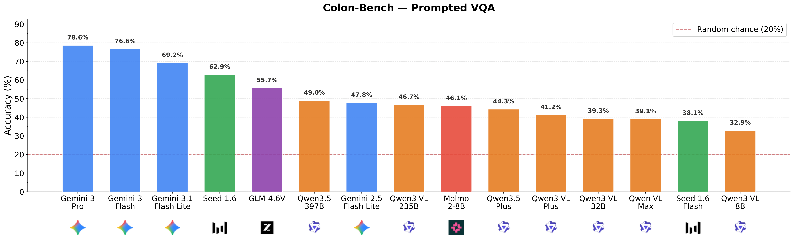
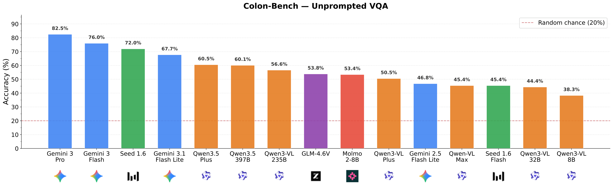
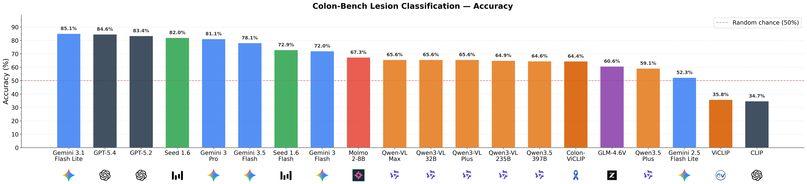
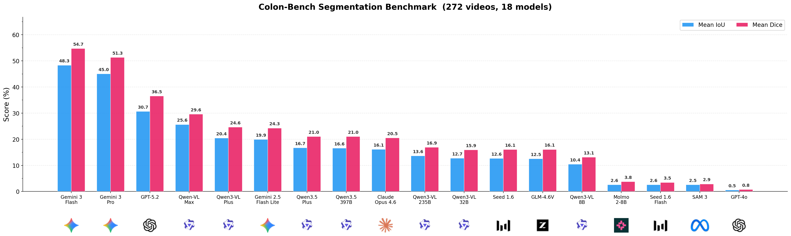

# Colon-Bench: Colonoscopy Video Understanding Benchmark for MLLMs 

<p align="center">
  <a href="https://abdullahamdi.com/colon-bench/"></a>
  <a href="https://arxiv.org/abs/2603.25645"></a>
  <a href="https://huggingface.co/datasets/ajhamdi/colon-bench"></a>
  <a href="https://github.com/ajhamdi/colon-bench-eval"></a>
  <a href="https://github.com/ajhamdi/colon-bench-eval/blob/main/LICENSE"></a>
</p>

**[Colon-Bench](https://abdullahamdi.com/colon-bench)** is a comprehensive, human-verified, multi-task video benchmark for colonoscopy understanding. It spans **14 lesion categories** (including polyps, ulcers, and bleeding), over **300,000 bounding boxes**, **213,000 segmentation masks**, and **133,000 words** of clinical descriptions.

`colon-bench-eval` is a compact toolkit for reproducing the main [Colon-Bench](https://abdullahamdi.com/colon-bench) benchmark numbers. It ships benchmark JSONs, canonical result files, plotting scripts, an interactive Streamlit viewer, and runnable MLLMs baselines for:

- **VQA** on `prompted` and `unprompted` splits
- **Binary lesion classification**
- **[EdgeTAM](https://github.com/facebookresearch/EdgeTAM)-based segmentation** pipeline

## Benchmark Preview

These figures give a quick visual snapshot of the benchmark's multi-task evaluation coverage across VQA, classification, and segmentation.

<table>
  <tr>
    <td width="50%" align="center">
      
      <br>
      <sub><b>VQA</b> - prompted split</sub>
    </td>
    <td width="50%" align="center">
      
      <br>
      <sub><b>VQA</b> - unprompted split</sub>
    </td>
  </tr>
  <tr>
    <td width="50%" align="center">
      
      <br>
      <sub><b>Classification</b> - lesion accuracy</sub>
    </td>
    <td width="50%" align="center">
      
      <br>
      <sub><b>Segmentation</b> - IoU and Dice metrics</sub>
    </td>
  </tr>
</table>


## Dataset Summary

| Statistic | Value |
|---|---|
| Total videos | 1,597 |
| Total video size | ~81 GB |
| Bounding boxes | 300,000+ |
| Segmentation masks | 213,000+ |
| Lesion categories | 14 |
| VQA questions (`prompted`) | 1,485 |
| VQA questions (`unprompted`) | 2,740 |
| Classification samples | 790 |
| Segmentation samples | 264 |

## What's Included

- **`notebooks/explore_colon_bench.ipynb`**: interactive dataset explorer — play videos, view questions/labels/masks inline
- `scripts/llm_evaluate_vqa.py`: VQA baseline with `--local` Qwen3-VL support
- `scripts/llm_evaluate_cls.py`: classification baseline
- `scripts/llm_evaluate_det_seg.py`: detection + [EdgeTAM](https://github.com/facebookresearch/EdgeTAM) segmentation
- `scripts/plot_*.py`: public plotting scripts for the shipped result JSONs
- `viewer/visualize_benchmark.py`: Streamlit benchmark browser
- `skills/colon-skill/SKILL.md`: optional VQA skill/context file (works with both prompted and unprompted)
- `data/colon-bench/`: benchmark JSONs and canonical result JSONs
- `plots/`: pre-generated public plot assets
- `edgetam/`: vendored [EdgeTAM](https://github.com/facebookresearch/EdgeTAM) source tree with bundled checkpoint

## Install

[uv](https://docs.astral.sh/uv/) is the recommended package manager.

### Full install (everything including local VLM and viewer)

```bash
git clone https://github.com/ajhamdi/colon-bench-eval.git
cd colon-bench-eval

uv sync --extra all
```

### Core-only install (API-based evaluation + [EdgeTAM](https://github.com/facebookresearch/EdgeTAM) segmentation)

```bash
uv sync
```

### Individual extras

```bash
uv sync --extra local-vlm   # adds Qwen3-VL for local VQA inference
uv sync --extra viewer       # adds Streamlit viewer, matplotlib, Jupyter
```

The [EdgeTAM](https://github.com/facebookresearch/EdgeTAM) checkpoint and its CUDA extension are built automatically by `uv sync` — no extra steps needed.

### Alternative: pip install

If you prefer plain pip over `uv`:

```bash
python -m venv .venv
source .venv/bin/activate
pip install -r requirements.txt
```

## API Keys & Authentication

You need two keys:

| Key | Purpose | Get one at |
|---|---|---|
| `HF_TOKEN` | Access the gated Colon-Bench dataset | [huggingface.co/settings/tokens](https://huggingface.co/settings/tokens) |
| `OPENROUTER_API_KEY` | API-based evaluation (VQA, classification, detection) | [openrouter.ai/keys](https://openrouter.ai/keys) |

[Colon-Bench](https://abdullahamdi.com/colon-bench) is public but gated — request access on the [dataset page](https://huggingface.co/datasets/ajhamdi/colon-bench), then provide your token below.

**Option A — export directly in your shell** (simplest, great for cloud sandboxes):

```bash
export OPENROUTER_API_KEY=sk-or-v1-...
export HF_TOKEN=hf_...
```

**Option B — use a `.env` file** (convenient for repeated local use):

```bash
cp .env.example .env
# edit .env and fill in your keys
```

The `.env` file is loaded automatically if `python-dotenv` is installed.
Both approaches work — shell exports always take priority.

> `python-dotenv` is optional. If you prefer not to install it, just export
> the keys in your terminal before running any script.

**Option C — Hugging Face CLI login** (alternative for `HF_TOKEN`):

```bash
hf auth login
```

Videos are streamed directly from Hugging Face Hub — no separate storage setup is needed.

## Supported Models

### [OpenRouter](https://openrouter.ai/) Models (API-based)

All evaluation scripts accept `--model <alias>` with any of the aliases below.
You can also pass a raw [OpenRouter](https://openrouter.ai/) slug (e.g. `openai/gpt-4o`) directly.

| Alias | Provider / Model | Video support |
|---|---|:---:|
| `gpt-4o` | OpenAI GPT-4o | |
| `gpt-5.2` | OpenAI GPT-5.2 | |
| `gpt-5.4` | OpenAI GPT-5.4 | |
| `claude-opus-4.6` | Anthropic Claude Opus 4.6 | |
| `molmo-2-8b` | AllenAI Molmo 2 8B | yes |
| `seed-1.6` | ByteDance Seed 1.6 | yes |
| `seed-1.6-flash` | ByteDance Seed 1.6 Flash | yes |
| `glm-4.6v` | Z-AI GLM-4.6V | yes |
| `qwen3-vl-8b` | Qwen3-VL 8B Instruct | yes |
| `qwen3-vl-32b` | Qwen3-VL 32B Instruct | yes |
| `qwen3-vl-235b` | Qwen3-VL 235B-A22B Instruct | yes |
| `qwen3-vl-plus` | Qwen-VL Plus | yes |
| `qwen-vl-max` | Qwen-VL Max | yes |
| `qwen3.5-plus` | Qwen3.5 Plus | yes |
| `qwen3.5-397b-a17b` | Qwen3.5 397B-A17B | yes |
| `gemini-2.5-flash` | Google Gemini 2.5 Flash | yes |
| `gemini-2.5-pro` | Google Gemini 2.5 Pro | yes |
| `gemini-2.5-flash-lite` | Google Gemini 2.5 Flash Lite | yes |
| `gemini-3-flash-preview` | Google Gemini 3 Flash Preview | yes |
| `gemini-3-pro-preview` | Google Gemini 3 Pro Preview | yes |
| `gemini-3.1-pro-preview` | Google Gemini 3.1 Pro Preview | yes |
| `gemini-3.1-flash-lite-preview` | Google Gemini 3.1 Flash Lite Preview | yes |

Models without video support use frame-based evaluation (frames are extracted and sent as images).

### Local Models (GPU)

Local inference is supported for the VQA task via `--local` (see [Run The Baselines](#vqa-locally-with-qwen3-vl-8b)). Requires `uv sync --extra local-vlm`.
Any **Qwen3-VL** checkpoint works via `--local-model-id`; larger variants auto-shard across GPUs.

| Model ID | Size | Notes |
|---|---|---|
| `Qwen/Qwen3-VL-8B-Instruct` | 8B | Default |
| `Qwen/Qwen3-VL-32B-Instruct` | 32B | ~65 GB VRAM or multi-GPU |
| `Qwen/Qwen3-VL-235B-A22B-Instruct` | 235B (MoE, 22B active) | Multi-GPU |

Only `HF_TOKEN` is required (no [OpenRouter](https://openrouter.ai/) key). Other model families from hugging face transformer models can be supported with mimimal adjustmenst to the code based.  

To verify access manually:

```bash
wget --header="Authorization: Bearer $HF_TOKEN" \
  "https://huggingface.co/datasets/ajhamdi/colon-bench/resolve/main/videos/<video_id>.mp4"
```

## Quick Dataset Explore

```python
from datasets import load_dataset

vqa_prompted = load_dataset("ajhamdi/colon-bench", "vqa-prompted", split="test")
vqa_unprompted = load_dataset("ajhamdi/colon-bench", "vqa-unprompted", split="test")
cls = load_dataset("ajhamdi/colon-bench", "classification", split="test")
seg = load_dataset("ajhamdi/colon-bench", "segmentation", split="test")

print(vqa_prompted[0])
print(vqa_unprompted[0])
print(cls[0])
print(seg[0])
```

> **Interactive notebook:**
> [`notebooks/explore_colon_bench.ipynb`](notebooks/explore_colon_bench.ipynb)
> plays videos inline, prints questions with answer choices, displays
> classification labels, and renders segmentation mask grids — all
> loaded directly from the Hugging Face dataset. Open it to browse any
> sample by changing `CONFIG` and `IDX`.

## Run The Baselines

> Make sure `OPENROUTER_API_KEY` and `HF_TOKEN` are set before running
> (see [API Keys & Authentication](#api-keys--authentication) above).
>
> All commands below use `uv run` which automatically uses the project
> virtual environment created by `uv sync`.

### VQA via [OpenRouter](https://openrouter.ai/)

Prompted split:

```bash
uv run python scripts/llm_evaluate_vqa.py \
  --benchmark data/colon-bench \
  --mode prompted \
  --model qwen3-vl-8b \
  --parallel \
  --max-workers 4
```

Unprompted split:

```bash
uv run python scripts/llm_evaluate_vqa.py \
  --benchmark data/colon-bench \
  --mode unprompted \
  --model gpt-4o
```

With the bundled skill prompt:

```bash
uv run python scripts/llm_evaluate_vqa.py \
  --benchmark data/colon-bench \
  --mode prompted \
  --model qwen3-vl-8b \
  --skill-file skills/colon-skill/SKILL.md
```

### VQA Locally With Qwen3-VL-8B

```bash
uv run --extra local-vlm python scripts/llm_evaluate_vqa.py \
  --benchmark data/colon-bench \
  --mode prompted \
  --local \
  --local-model-id Qwen/Qwen3-VL-8B-Instruct
```

The local path downloads videos from the dataset on demand when a local `videos/` directory is not present.
Only `HF_TOKEN` is needed (no [OpenRouter](https://openrouter.ai/) key required).

### Classification

```bash
uv run python scripts/llm_evaluate_cls.py \
  --benchmark data/colon-bench \
  --model qwen3-vl-8b \
  --parallel \
  --max-workers 4
```

### Segmentation

Segmentation is evaluated as a two-stage pipeline: first run lesion detection to produce prompts, then run [EdgeTAM](https://github.com/facebookresearch/EdgeTAM)-based segmentation from those detections.

```bash
# Stage 1: detection proposals for the segmentation pipeline
uv run python scripts/llm_evaluate_det_seg.py \
  --benchmark data/colon-bench \
  --model qwen3-vl-8b \
  --frames-count 3 \
  --parallel \
  --max-workers 4

# Stage 2: EdgeTAM segmentation from detection outputs
uv run python scripts/llm_evaluate_det_seg.py \
  --benchmark data/colon-bench \
  --model qwen3-vl-8b \
  --seg \
  --checkpoint edgetam/checkpoints/edgetam.pt \
  --model-cfg edgetam.yaml
```

The segmentation evaluator downloads GT masks from the Hugging Face dataset when `data/colon-bench/masks/` is not present locally.


## Canonical Results And Plots

This repo ships canonical public result JSONs in:

- `data/colon-bench/eval_results/`
- `data/colon-bench/cls_results/`
- `data/colon-bench/det_results/`

The pre-generated public figures are in `plots/`. To replot from the shipped JSONs:

```bash
uv run python scripts/plot_vqa_accuracy.py \
  --save plots/vqa_accuracy_prompted.pdf plots/vqa_accuracy_unprompted.pdf

uv run python scripts/plot_classification_metrics.py \
  --save plots/cls_accuracy.pdf plots/cls_prf1.pdf

uv run python scripts/plot_detection_metrics.py \
  --save plots/detection_metrics.pdf

uv run python scripts/plot_segmentation_metrics.py \
  --save plots/segmentation_metrics.pdf
```

## Streamlit Viewer

Run the bundled viewer from the repo root:

```bash
uv run --extra viewer streamlit run viewer/visualize_benchmark.py -- --benchmark data/colon-bench --mode vqa_prompted
```

Notes:

- Modes: **VQA** (prompted and unprompted), **classification**, and **segmentation** (detection is not shown in the viewer).
- Uses the shipped benchmark JSONs under `data/colon-bench/`. Clips resolve from a local `videos/` directory when present; otherwise they are downloaded from the Hugging Face dataset (set `HF_TOKEN` or run `hf auth login` for gated access).
- **Segmentation** builds an overlaid video from the benchmark clip plus ground-truth masks: assets are pulled from Hugging Face when not already on disk, with parallel mask downloads for faster first-time loading.

## Optional: Pre-download the dataset (faster repeat runs)

By default, videos and masks are fetched **on demand** (one file or a small batch per request). To avoid repeated network hits during Streamlit browsing, notebook exploration, or evaluation runs, you can **pre-download the full dataset** into the Hugging Face Hub cache once.

**Put the cache on a large or fast disk** by setting `HF_HOME` before any Python or CLI command (default is `~/.cache/huggingface`). Hub downloads land under `$HF_HOME/hub`. To move only the file cache (not other HF data), set `HUGGINGFACE_HUB_CACHE` instead. All `huggingface_hub` usage in this repo respects these variables:

```bash
export HF_HOME=/path/to/your/hf_cache   # optional
export HF_TOKEN=hf_...                   # required for the gated dataset
```

**Warm the cache** with the Hugging Face CLI (same environment as above). This pulls the full dataset into the Hub cache so later calls resolve locally:

```bash
hf download ajhamdi/colon-bench --repo-type dataset --max-workers 16
```

After this finishes, the Streamlit viewer, `notebooks/explore_colon_bench.ipynb`, and the `scripts/llm_evaluate_*.py` pipelines hit the cache instead of downloading each asset on demand. Dataset size is large (~81 GB of video alone); plan disk space accordingly.

## 🏆 Colon-Bench Leaderboard

<table>
  <thead>
    <tr>
      <th>Model</th>
      <th>VQA Prompted</th>
      <th>VQA Unprompted</th>
      <th>Cls. Accuracy</th>
      <th>Cls. Precision</th>
      <th>Cls. Recall</th>
      <th>Cls. F1</th>
      <th>Seg. IoU</th>
      <th>Seg. Dice</th>
    </tr>
  </thead>
  <tbody>
    <tr><td>CLIP</td><td>—</td><td>—</td><td>34.7</td><td>34.5</td><td>100</td><td>51.3</td><td>—</td><td>—</td></tr>
    <tr><td>ViCLIP</td><td>—</td><td>—</td><td>35.8</td><td>34.8</td><td>98.5</td><td>51.4</td><td>—</td><td>—</td></tr>
    <tr><td>Endo-CLIP</td><td>—</td><td>—</td><td>52.9</td><td>41.9</td><td>95.2</td><td>58.2</td><td>—</td><td>—</td></tr>
    <tr><td>Colon-ViCLIP</td><td>—</td><td>—</td><td>64.4</td><td>49.0</td><td>84.2</td><td>62.0</td><td>—</td><td>—</td></tr>
    <tr><td>SAM 3</td><td>—</td><td>—</td><td>—</td><td>—</td><td>—</td><td>—</td><td>2.5</td><td>2.9</td></tr>
    <tr><td>GPT-4o</td><td>—</td><td>—</td><td>—</td><td>—</td><td>—</td><td>—</td><td>0.5</td><td>0.8</td></tr>
    <tr><td>Claude Opus 4.6</td><td>—</td><td>—</td><td>—</td><td>—</td><td>—</td><td>—</td><td>16.1</td><td>20.5</td></tr>
    <tr><td>GPT-5.2</td><td>—</td><td>—</td><td>—</td><td>—</td><td>—</td><td>—</td><td>30.7</td><td>36.5</td></tr>
    <tr><td>GPT-5.4</td><td>—</td><td>—</td><td>—</td><td>—</td><td>—</td><td>—</td><td>34.5</td><td>41.1</td></tr>
    <tr><td>Qwen3-VL 8B</td><td>32.9</td><td>38.3</td><td>34.4</td><td>34.4</td><td>100</td><td>51.2</td><td>10.4</td><td>13.1</td></tr>
    <tr><td>Seed 1.6 Flash</td><td>38.1</td><td>45.4</td><td>72.9</td><td><b>94.2</b></td><td>24.3</td><td>38.6</td><td>2.6</td><td>3.5</td></tr>
    <tr><td>Qwen-VL Max</td><td>39.1</td><td>45.4</td><td>65.6</td><td>0.0</td><td>0.0</td><td>0.0</td><td>25.6</td><td>29.6</td></tr>
    <tr><td>Qwen3-VL 32B</td><td>39.3</td><td>44.4</td><td>65.6</td><td>0.0</td><td>0.0</td><td>0.0</td><td>12.7</td><td>15.9</td></tr>
    <tr><td>Qwen3.5 Plus</td><td>44.3</td><td>60.5</td><td>59.1</td><td>36.2</td><td>24.6</td><td>29.3</td><td>16.7</td><td>21.0</td></tr>
    <tr><td>Molmo 2-8B</td><td>46.1</td><td>53.4</td><td>67.3</td><td>52.9</td><td>46.7</td><td>49.6</td><td>2.6</td><td>3.8</td></tr>
    <tr><td>Qwen3-VL 235B</td><td>46.7</td><td>56.6</td><td>64.9</td><td>22.2</td><td>0.7</td><td>1.4</td><td>13.6</td><td>16.9</td></tr>
    <tr><td>Gemini 2.5 Flash Lite</td><td>47.8</td><td>46.8</td><td>52.3</td><td>42.3</td><td>95.9</td><td>58.7</td><td>19.9</td><td>24.3</td></tr>
    <tr><td>Qwen3.5 397B</td><td>49.0</td><td>60.1</td><td>64.6</td><td>10.0</td><td>0.4</td><td>0.7</td><td>16.6</td><td>21.0</td></tr>
    <tr><td>GLM-4.6V</td><td>55.7</td><td>53.8</td><td>60.6</td><td>46.5</td><td>94.1</td><td>62.2</td><td>12.5</td><td>16.1</td></tr>
    <tr><td>Seed 1.6</td><td>62.9</td><td>72.0</td><td>82.0</td><td>85.0</td><td>58.7</td><td>69.4</td><td>12.6</td><td>16.1</td></tr>
    <tr><td>Gemini 3.1 Flash Lite</td><td>69.2</td><td>67.7</td><td><b>85.1</b></td><td>72.6</td><td>90.8</td><td><b>80.7</b></td><td>37.4</td><td>43.4</td></tr>
    <tr><td>Gemini 3 Flash</td><td>76.6</td><td>76.0</td><td>72.0</td><td>55.3</td><td>97.1</td><td>70.5</td><td><b>48.3</b></td><td><b>54.7</b></td></tr>
    <tr><td>Gemini 3 Pro</td><td><b>78.6</b></td><td><b>82.5</b></td><td>81.1</td><td>66.1</td><td>93.0</td><td>77.3</td><td>45.0</td><td>51.3</td></tr>
  </tbody>
</table>

## Acknowledgements

Segmentation in this repo builds on [EdgeTAM](https://github.com/facebookresearch/EdgeTAM); we gratefully acknowledge the authors for releasing the model and code.

The original unprocessed colonoscopy videos underlying Colon-Bench were sourced from the [REAL-Colon dataset](https://www.nature.com/articles/s41597-024-03359-0), and we gratefully acknowledge the REAL-Colon authors for making that foundational dataset publicly available.

## Citation

If you use [Colon-Bench](https://abdullahamdi.com/colon-bench), please cite:

```bibtex
@misc{hamdi2026colonbench,
  title={Colon-Bench: An Agentic Workflow for Scalable Dense Lesion Annotation in Full-Procedure Colonoscopy Videos},
  author={Abdullah Hamdi and Changchun Yang and Xin Gao},
  year={2026},
  eprint={2603.25645},
  archivePrefix={arXiv},
  primaryClass={eess.IV},
  url={https://arxiv.org/abs/2603.25645}
}
```

## Links

| | |
|---|---|
| Paper | [arXiv:2603.25645](https://arxiv.org/abs/2603.25645) |
| Project page | [abdullahamdi.com/colon-bench](https://abdullahamdi.com/colon-bench) |
| Dataset | [huggingface.co/datasets/ajhamdi/colon-bench](https://huggingface.co/datasets/ajhamdi/colon-bench) |
| Code | [github.com/ajhamdi/colon-bench-eval](https://github.com/ajhamdi/colon-bench-eval) |
| License | [CC-BY-4.0](LICENSE) |
